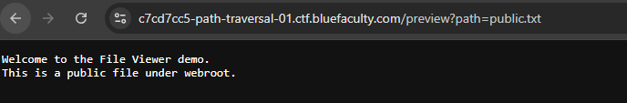
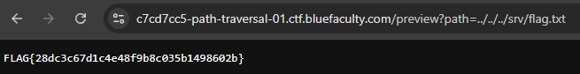

# Path Traversal sur File Viewer (BlueFaculty - CH02)

Deuxième challenge de la série OWASP Top 10 chez BlueFaculty, cette fois sur une faille tout aussi classique que l'IDOR mais qui touche directement le système de fichiers : le path traversal.

## Le contexte

L'appli s'appelle "File Viewer" — une démo minimaliste qui affiche le contenu de fichiers via un paramètre dans l'URL :

```
/preview?path=public.txt
```

Elle retourne le contenu attendu :

```
Welcome to the File Viewer demo.
This is a public file under webroot.
```



Rien d'alarmant à première vue. Mais dès qu'une appli accepte un chemin de fichier tel quel en paramètre, la première question à se poser c'est : est-ce que je peux sortir du dossier prévu ?

## Le raisonnement

Le paramètre `path` sert visiblement à construire un chemin côté serveur, probablement un truc du style :

```
webroot/ + path
```

Si l'appli ne filtre pas les séquences de remontée de répertoire (`../`), rien n'empêche en théorie de sortir du dossier `webroot` pour aller fouiller ailleurs sur le système.

## L'exploitation

Test direct avec une remontée de répertoire :

```
/preview?path=../../../srv/flag.txt
```

Ça passe sans aucun filtrage. Le serveur va chercher le fichier en dehors du webroot, exactement là où je lui demande, et retourne :

```
FLAG{28dc3c67d1c4e48f9b8c035b1498602b}
```



Trois `../` suffisent à remonter jusqu'à la racine puis à redescendre dans `/srv/`, là où traînait le flag.

## Pourquoi ça marche

Le serveur construit le chemin final en concaténant bêtement une base fixe avec l'entrée utilisateur, sans jamais vérifier que le résultat reste bien à l'intérieur du dossier autorisé. En clair :

```
Attendu : webroot/public.txt
Réel    : webroot/../../../srv/flag.txt → résolu en /srv/flag.txt
```

Le `../` est un opérateur système standard (remonter d'un niveau dans l'arborescence), et rien dans le code ne vient neutraliser ou normaliser ce genre de séquence avant de l'utiliser pour aller lire le fichier sur le disque.

## Ce que je retiens

Le réflexe à avoir dès qu'un paramètre ressemble de près ou de loin à un chemin de fichier, un nom de fichier ou une référence à une ressource statique : tester une remontée de répertoire basique avant toute chose. `../../../etc/passwd` reste le test de référence sous Linux pour confirmer rapidement qu'une appli est vulnérable, `flag.txt` ou tout autre fichier connu du contexte fait aussi très bien l'affaire.

Sur ce challenge il n'y avait aucune protection : pas de normalisation du chemin, pas de whitelist de fichiers autorisés, pas de sandbox. En vrai, même une appli qui filtre `../` peut parfois être contournée avec de l'encodage (`%2e%2e%2f`) ou des variantes — mais ici la faille est directe, aucun contournement nécessaire.

Côté remédiation : ne jamais faire confiance à un chemin fourni par l'utilisateur. Soit on résout le chemin final et on vérifie qu'il reste bien sous le dossier autorisé (`realpath` + comparaison de préfixe), soit encore mieux, on ne travaille jamais avec des noms de fichiers arbitraires côté client — on utilise un identifiant qui pointe vers une liste de fichiers autorisés côté serveur.

---

*Outils : navigateur uniquement, modification manuelle du paramètre d'URL.*
