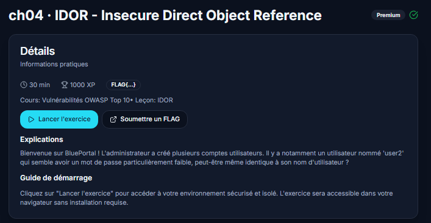
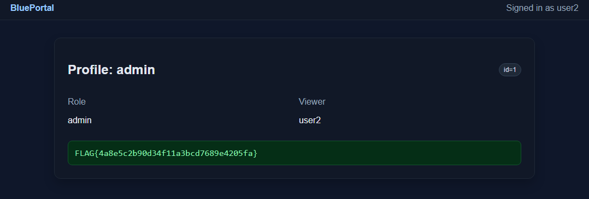

# IDOR sur BluePortal (BlueFaculty - CH04)

Petit challenge sympa sur les IDOR, un classique du Top 10 OWASP mais toujours aussi efficace pour comprendre pourquoi le contrôle d'accès côté serveur n'est pas une option.



## Le contexte

BluePortal est une appli de démo avec plusieurs comptes utilisateurs. L'énoncé donne un indice assez gros : un des comptes, `user2`, aurait un mot de passe faible, potentiellement identique à son login. Classique, mais ça reste la porte d'entrée la plus fréquente en vrai en entreprise aussi, les mots de passe par défaut jamais changés, c'est un grand classique des audits.

## Premier accès

J'ai testé le plus simple possible :

```
login: user2
password: user2
```

Ça passe direct. Aucune politique de mot de passe, aucun blocage après tentative. Sur une vraie appli en prod ça serait déjà un finding à remonter en soi.

## Repérer le paramètre

Une fois dedans, je regarde la page de profil. Il y a un paramètre `id` qui traîne dans la requête : `id=2`. Rien d'exotique, c'est le genre de truc qu'on croise sur 90% des applis qui gèrent des comptes utilisateurs. Le réflexe à avoir dès qu'on voit un identifiant numérique comme ça : est-ce que le serveur vérifie vraiment que je suis autorisé à demander CET id précis, ou est-ce qu'il fait juste "ok tu veux l'id X, tiens voilà les données de l'id X" sans se poser de questions ?

Un seul moyen de savoir : tester.

## L'exploitation

Je change `id=2` en `id=1`, comme ça, à la main dans l'URL.

Et là, ça passe. Le serveur me renvoie le profil complet du compte `admin`, alors que ma session est toujours celle de `user2` (c'est écrit noir sur blanc dans la page : "Viewer: user2"). Ça confirme exactement ce qu'on soupçonnait : l'app fait confiance à l'id fourni par le client, point. Pas de vérification "est-ce que l'utilisateur en session a le droit de voir CE profil".



Le flag tombe dans la foulée :

```
FLAG{4a8e5c2b90d34f11a3bcd7689e4205fa}
```

## Pourquoi ça marche

C'est le cœur même de l'IDOR : une référence directe à un objet (ici un `id` de profil) exposée au client, sans couche d'autorisation derrière. Le développeur a probablement codé quelque chose comme :

```
GET /profile?id=X
→ retourne les données du profil X, sans plus de vérification
```

Alors qu'il aurait fallu :

```
GET /profile?id=X
→ est-ce que session.user_id a le droit de voir le profil X ?
→ si non : 403
→ si oui : retourne les données
```

Cette vérification manque, et c'est tout ce qu'il faut pour qu'un utilisateur lambda se retrouve à consulter les données d'un admin juste en changeant un chiffre dans l'URL.

## Ce que je retiens

Deux petites faiblesses combinées ici : un mot de passe trivial pour rentrer, et un contrôle d'accès absent une fois dedans. Prises séparément, chacune semble presque anecdotique. Ensemble, ça donne un accès admin complet en trente secondes sans le moindre outil.

Le réflexe à garder pour la suite : dès que je vois un `id`, `uid`, `user_id`, `account_id` ou équivalent dans une requête, je teste systématiquement l'incrémentation/décrémentation avant de passer à autre chose. C'est souvent le test le plus rapide à faire et il paie régulièrement, y compris sur des applis censées être "sérieuses".

## Comment se protéger

- **Contrôle d'accès côté serveur, à chaque requête** : ne jamais se fier à un `id` fourni par le client. Vérifier que la session a bien le droit de lire / modifier *cet* objet précis (ownership ou rôle), sinon renvoyer `403`.
- **Ne pas s'appuyer sur l'obscurité des IDs** : même avec des UUID, l'autorisation reste obligatoire. Les IDs séquentiels facilitent juste la découverte ; ce n'est pas la cause racine.
- **Mots de passe solides + politique minimale** : interdire les mots de passe égaux au login, imposer une longueur / complexité raisonnable, et limiter les tentatives (rate limiting / lockout).
- **Tests automatisés d'accès** : écrire des tests qui vérifient qu'un user A ne peut pas accéder aux ressources de user B (et encore moins à celles d'un admin).
- **Principe du moindre privilège** : ne renvoyer dans les réponses que les champs nécessaires ; un profil "admin" ne devrait pas exposer un secret / flag à un viewer non autorisé.

---

*Outils : navigateur uniquement, modification manuelle du paramètre d'URL, pas besoin de Burp pour celui-là.*
